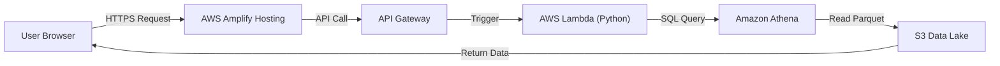

# 🚀 Amazon Product Risk Dashboard (Frontend)

## 📖 Overview
This repository contains the **Frontend Source Code** for the *Amazon Product Risk Analysis System*. 

It is a serverless web dashboard that visualizes the output of our Machine Learning pipeline. It allows stakeholders to instantly view product defect risks, "Return Radar" scores, and sentiment trends without needing access to the underlying raw data or Power BI.

**🔗 Live Demo:** [Insert your AWS Amplify URL here]

---

## 🏗️ Architecture
This site is the "Presentation Layer" of a larger Data Engineering pipeline. It does not store data itself but fetches it in real-time from our Data Lake.

