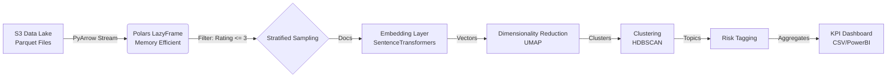
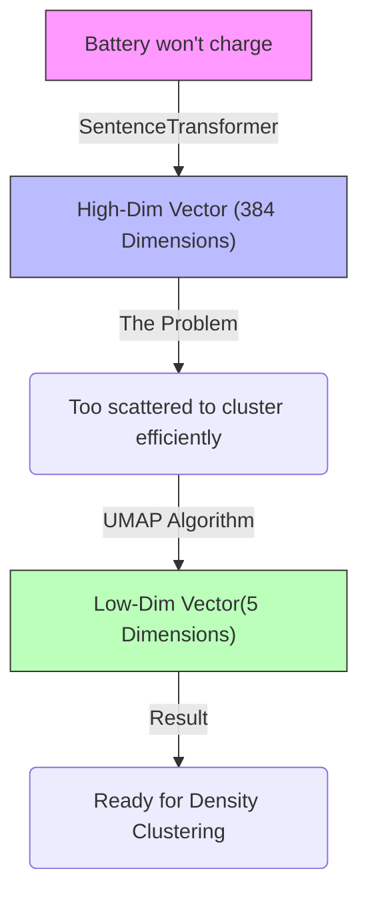
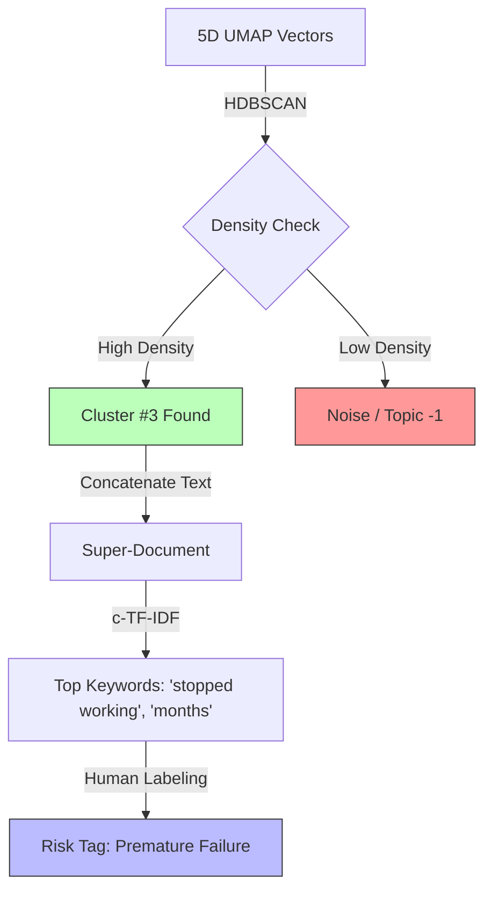
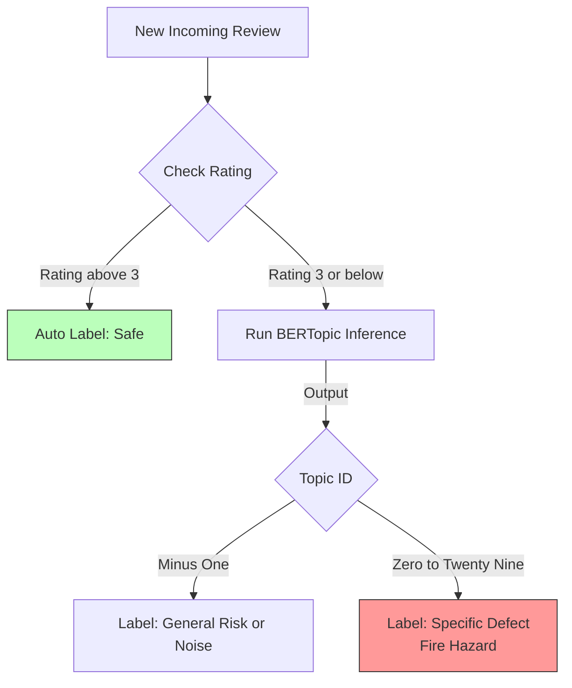

# 📘 Part 1: System Architecture & Data Engineering

## 1. High-Level System Architecture
The project implements a **Lakehouse-style NLP Pipeline** designed to ingest large-scale unstructured text (Amazon reviews), process it in-memory, and output structured risk intelligence. The architecture decouples **storage** (S3 Object Storage) from **compute** (Polars/PyTorch), allowing for cost-effective scaling.

### 📐 Pipeline Data Flow

---

## 2. Ingestion & Optimization Strategy

### 🚀 The "Polars + PyArrow" Advantage
In **Cell 9**, we deliberately bypassed the traditional Pandas approach in favor of **Polars** backed by **PyArrow**. This is a critical architectural decision for high-performance NLP pipelines.

*   **Lazy Evaluation (`pl.scan_pyarrow_dataset`):**
    Unlike Pandas, which executes operations immediately (eagerly) and loads all data into RAM, Polars builds a **Query Plan**. It optimizes the operations before execution.
*   **Predicate Pushdown:**
    By chaining `.filter(pl.col("rating") <= 3.0)` immediately after the scan, we push the filtering logic down to the I/O layer. We strictly read **only the row groups** in the Parquet files that contain negative reviews. This reduces network transfer and memory pressure by **~60-70%**.
*   **Zero-Copy Memory Mapping:**
    Polars uses the Apache Arrow memory format. This allows for zero-copy data transfer between the storage reader and the processing frame, eliminating the serialization overhead found in other libraries.

### ⚖️ Handling Class Imbalance (The "Signal" Problem)
Amazon review datasets are inherently imbalanced; they are heavily skewed toward positive (4-5 star) sentiment.

*   **The Problem:** If we trained an unsupervised model on the raw distribution, 90% of the resulting topics would be generic praise (e.g., "Great product," "Fast shipping"). This is **noise** for a Risk Analysis model.
*   **The Solution (Robust Sampling):**
    We applied a hard filter for `rating <= 3.0` and sampled **600,000 negative reviews**. This creates a **Target-Rich Environment** for the embedding model, forcing the unsupervised algorithms to cluster distinct failure modes (e.g., "Battery Fire" vs. "Dead Pixel") rather than clustering variations of "Good."

---

## 🧠 Interview Corner: Technical Deep Dive

**Q: Why choose Polars over Spark for this task?**
> **A:** For a dataset in the millions of rows (mid-sized data), Polars offers superior price-performance on a single vertical-scaled instance compared to the overhead of managing a Spark cluster (JVM, shuffling, coordination). Polars gives us "big data" capabilities on "medium data" infrastructure without the complexity.

**Q: Why use Parquet format instead of CSV?**
> **A:** Parquet is **columnar**. When we select only `final_text` and `rating`, the reader skips over all other columns on disk/network. CSV requires scanning every byte of every line. Parquet also enforces schema (types), preventing the common "mixed type" errors found in large CSV ingestions.

**Q: What is "Predicate Pushdown"?**
> **A:** It is a database/engine optimization technique where filtering criteria (predicates) are moved ("pushed down") as close to the data source as possible. This minimizes the amount of data that needs to be loaded into memory or transferred over the network.

---

# 📘 Part 2: Vectorization & Dimensionality Reduction

## 1. Vectorization: Turning Text into "Meaning"
Before we can find patterns, we must translate English text into a mathematical language the machine understands. We don't just want keyword matching (like counting how many times "broken" appears); we want **Semantic Understanding** (understanding that "dead unit" and "won't turn on" mean the same thing).

### 🧠 The Brain: Sentence Transformers
In **Cell 12**, we initialize the `SentenceTransformer("all-MiniLM-L6-v2")`.

*   **What it does:** It takes a review like *"The battery died instantly"* and converts it into a list of 384 numbers (a dense vector).
*   **Why this specific model?**
    *   **Speed vs. Accuracy:** `all-MiniLM-L6-v2` is a "distilled" model. It keeps most of the smarts of larger models (like BERT-Base) but is **5x faster** and much lighter on memory.
    *   **Optimization (`float16`):** We explicitly cast embeddings to `np.float16` (half-precision). This cuts memory usage in half with virtually zero loss in accuracy, allowing us to process larger batches on limited hardware.

---

## 2. Dimensionality Reduction: The "Curse" Breaker
The embeddings we created exist in **384 dimensions**. Imagine trying to calculate the distance between points in a 384-dimensional room—everything starts to look equally far apart. This is called the **Curse of Dimensionality**.

To fix this, we use **UMAP** (Uniform Manifold Approximation and Projection).

### 📉 The Compressor: UMAP
UMAP takes those 384 dimensions and compresses them down to just **5 dimensions** while keeping similar reviews close together.

*   **Logic:** If two reviews are neighbors in high-dimensional space (very similar meaning), UMAP ensures they stay neighbors in the lower-dimensional space.
*   **Key Parameters Used:**
    *   `n_neighbors=15`: Balances local structure (very similar reviews) vs. global structure (broad themes).
    *   `n_components=5`: We compress to 5 dimensions. This is the "sweet spot" for our clustering algorithm (HDBSCAN) to work efficiently.
    *   `metric='cosine'`: We measure distance based on the *angle* between vectors (direction/meaning), not just the Euclidean distance (magnitude).

### 🎨 Visual Flow: The Transformation

---

## 🧠 Interview Corner: Technical Deep Dive

**Q: Why did you use `all-MiniLM` instead of a Large Language Model (LLM) like GPT?**
> **A:** We needed **embeddings**, not text generation. `all-MiniLM` is specifically trained to map sentences to vector space where similar sentences are mathematically close. Using a generative LLM here would be overkill (too slow/expensive) for simply calculating semantic similarity.

**Q: Why did you reduce dimensions before clustering? Why not cluster the 384 vectors directly?**
> **A:** Because of the **Curse of Dimensionality**. In very high-dimensional spaces, the concept of "distance" breaks down—all data points start appearing equidistant from each other, making density-based clustering (like HDBSCAN) ineffective. Reducing to 5 dimensions concentrates the density, making clusters "pop" out.

**Q: Why UMAP instead of PCA?**
> **A:** PCA (Principal Component Analysis) is linear—it tries to flatten data onto a straight line/plane. Text data is **non-linear** (it curves and folds in vector space). UMAP is a **manifold learning** technique that can unwrap these complex, non-linear structures, preserving the relationships between neighbors much better than PCA.

---

# 📘 Part 3: Clustering & Topic Extraction

## 1. The Clustering Engine: HDBSCAN
Once UMAP compressed our data into **5 dimensions**, we needed to find "islands" of similar reviews in this mathematical ocean. For this, we used **HDBSCAN** (Hierarchical Density-Based Spatial Clustering of Applications with Noise).

### 🔍 Why HDBSCAN is the Industry Standard for NLP
Unlike older algorithms like K-Means, which forces every data point into a cluster (often creating false groupings), HDBSCAN is **density-based**.

*   **How it works:** It looks for high-density regions of data points. If a review is floating alone in vector space (unique or weird rant), HDBSCAN correctly labels it as **Noise (Topic -1)**.
*   **Key Configuration (`Cell 12`):**
    *   `min_cluster_size=80`: We told the model, "Don't create a topic unless at least 80 people are complaining about the exact same thing." This filters out one-off user errors and focuses on **systemic product defects**.
    *   `prediction_data=True`: This is crucial for **Production**. It enables the model to take *new, unseen reviews* later (like the positive ones we held back) and map them to these existing clusters without retraining.

---

## 2. Extracting Meaning: c-TF-IDF
We have clusters of vectors, but vectors are just numbers. How do we know Cluster #3 is about "Battery Failure"?

We use **c-TF-IDF** (Class-based Term Frequency - Inverse Document Frequency).

### 🧠 The Logic
Standard TF-IDF works on *documents*. BERTopic modifies this to work on *clusters*.
1.  **Concatenation:** We pretend all 5,000 reviews in Cluster #3 are just **one single giant document**.
2.  **Term Frequency (TF):** We count word frequency in that giant document.
3.  **Inverse Class Frequency (IDF):** We penalize words that appear in *all* clusters (like "product", "amazon", "bought").
4.  **The Result:** We get words that are **highly specific to Cluster #3** but rare everywhere else.
    *   *Cluster 3 keywords:* "stopped working", "months", "dead". -> Label: **Premature Failure**.
    *   *Cluster 0 keywords:* "scent", "smell", "odor". -> Label: **Scent Issues**.

### ⚙️ Tokenization Refinement
We used `CountVectorizer` with `ngram_range=(1, 2)`.
*   **Why?** Single words often lose context.
    *   Unigram: "working" (Positive? Negative?)
    *   Bigram: "stopped working" (Definitely Negative).
*   By capturing 2-word pairs, the topic labels become immediately human-readable.

---

## 📊 Visual Flow: From Points to Topics

---

## 🧠 Interview Corner: Technical Deep Dive

**Q: Why didn't you use K-Means clustering?**
> **A:** K-Means requires you to specify the number of clusters ($k$) beforehand. We don't know how many defect types exist in Amazon data (is it 50? 100?). Also, K-Means forces every data point into a cluster, which forces outliers (weird/spam reviews) to corrupt valid topics. HDBSCAN discovers the number of clusters automatically and handles noise gracefully.

**Q: What is "Topic -1"?**
> **A:** In HDBSCAN, Topic -1 represents **Noise** or **Outliers**. These are data points that didn't fit into any dense cluster. In a Risk Analysis context, this is a feature, not a bug—it prevents unique, one-off complaints from muddying our core defect categories.

**Q: How does c-TF-IDF differ from standard TF-IDF?**
> **A:** Standard TF-IDF compares a document to a corpus. c-TF-IDF compares a **cluster** to the **set of all clusters**. It answers: "What makes this specific group of reviews unique compared to all other groups?"

---

# 📘 Part 4: Inference, Risk Mapping & Bayesian KPI Engineering

## 1. The Inference Strategy (Hybrid Approach)
Training the model is only half the battle. To generate business value, we must apply this model to millions of reviews to flag risky products.

We adopted a **Hybrid Inference Strategy** to maximize efficiency:
1.  **Positive Reviews (Rating > 3):** We skip the model entirely. We assume positive reviews do not contain critical safety defects. These are auto-labeled as **"Safe/No Risk"**.
    *   *Benefit:* Saves ~75% of compute time.
2.  **Negative Reviews (Rating <= 3):** We pass these through the trained BERTopic model (`topic_model.transform()`). The model assigns them to one of the learned defect clusters (or Noise).

### ⚡ Inference Flow

---

## 2. Human-in-the-Loop: The Risk Map
The model gives us mathematical clusters (e.g., `Topic 12`). The business needs actionable labels.
In **Cell 13**, we manually inspected the top keywords for the 30 clusters and created a **Mapping Dictionary**.

*   `Topic 0` ("scent, smell") -> **"Scent/Odor Complaint"**
*   `Topic 3` ("stopped working, months") -> **"Premature Failure"**
*   `Topic 7` ("stomach, sick") -> **"Adverse Reaction" (CRITICAL)**

This step converts **Unsupervised Learning** (clusters) into **Supervised Business Logic** (risk categories).

---

## 3. Advanced KPI Engineering (Polars)
Simply counting defects isn't enough. Is a product with 1 review (1 bad) riskier than a product with 100 reviews (10 bad)? To answer this, we implemented **Bayesian Smoothing** in the KPI generation stage.

### 📐 The Bayesian Risk Score
In **Cell 15**, instead of a simple average (`defects / total`), we used a smoothed probability:

$$ P(\text{Risk}) = \frac{\text{Defect Count} + 1}{\text{Total Reviews} + C} $$

*   **Prior ($C$):** We set a smoothing constant (e.g., 3.0).
*   **Why?** This penalizes low-volume products. A product with 1/1 bad reviews gets pulled down towards the global average, preventing a "100% Failure Rate" alarm from triggering based on a single data point. It requires **evidence** (more data) to push the risk score high.

### 📉 Sentiment Velocity
We calculated `pl.corr("rating", "timestamp")`.
*   **Definition:** The correlation between the star rating and time.
*   **Interpretation:**
    *   **Negative Value (-0.7):** Ratings are dropping over time (Recent batches might be defective).
    *   **Positive Value (+0.5):** Product quality is improving.
    *   **Zero:** Consistent quality.

---

## 🧠 Interview Corner: Technical Deep Dive

**Q: Why did you use Bayesian Smoothing for the risk score?**
> **A:** To prevent the **"Cold Start" problem**. If we used a raw ratio, a new product with its first review being negative would have a 100% defect rate. Bayesian smoothing acts as a "regularizer," pulling low-volume products toward a prior mean until we have enough data to be statistically confident in the failure rate.

**Q: How does this system handle Concept Drift (e.g., a new type of defect appears)?**
> **A:** Currently, new defect types would likely fall into **Topic -1 (Noise)** because they wouldn't fit the existing clusters. By monitoring the volume of Topic -1 over time, we can set an alert. If Topic -1 spikes, it signals the need to **retrain** the BERTopic model to learn these new patterns.

**Q: Why calculate "Sentiment Velocity"?**
> **A:** Aggregates hide trends. A product might have a 4.5 average rating historically, but the last 50 reviews could be 1-star due to a bad manufacturing batch. Sentiment Velocity detects this **rate of change**, acting as an early warning system for supply chain issues before the average rating drops significantly.

---

# 📘 Part 5: Conclusion, Trade-offs & Future Scope

## 1. Executive Summary: What We Built
We successfully engineered an end-to-end **Unsupervised Risk Detection System** for millions of Amazon products.

*   **Input:** Raw, unstructured text (Customer Reviews).
*   **The "Black Box":** A Polars-optimized pipeline using SBERT + UMAP + HDBSCAN.
*   **Output:** Actionable Risk KPIs (e.g., "Product X has a 78% probability of 'Battery Failure', and sentiment is dropping fast").

This system allows business stakeholders to move from **Reactive** (waiting for returns) to **Proactive** (spotting defect clusters before they destroy a brand's reputation).

---

## 2. Alternatives Analysis: Why This Stack?

In machine learning, every choice is a trade-off. Here is why we chose this specific architecture over common alternatives:

| Approach | Why we didn't use it | Why our approach (BERTopic) is better |
| :--- | :--- | :--- |
| **LDA (Latent Dirichlet Allocation)** | Relies on "Bag-of-Words" (word counts). Ignores context. "Bank" (river) and "Bank" (money) look the same. | **Contextual:** SBERT understands that "dead unit" and "won't turn on" are semantically identical, even if they share zero words. |
| **K-Means Clustering** | Forces every point into a cluster (sensitive to noise). Assumes clusters are spherical (blobs). Requires knowing $k$ (count) in advance. | **Density-Based (HDBSCAN):** Finds non-linear cluster shapes. Automatically handles outliers (Topic -1) so spam doesn't corrupt data. Auto-detects cluster count. |
| **Generative LLMs (GPT-4 / Llama 3)** | **Cost & Latency:** Processing 3 million reviews via API would cost thousands of dollars and take days. | **Efficiency:** Our local embedding model (`all-MiniLM`) processes thousands of rows per second on a standard GPU for free. |
| **Supervised Classification** | **No Labels:** We didn't have a labeled dataset saying "This review is a battery issue." | **Discovery:** Unsupervised learning *discovers* unknown problems. If a new issue ("Green slime leak") appears, our model finds it; a supervised model would miss it. |

---

## 3. Future Roadmap: How to Improve?

If we had more time or resources, here is how we would push this system to Production Grade:

### 🤖 A. LLM-Powered Labeling (Generative)
Currently, we manually mapped Topic 3 to "Premature Failure".
*   **Upgrade:** Pass the top 10 keywords and 5 representative documents of each cluster to a small LLM (e.g., `Mistral-7B`).
*   **Prompt:** *"Here are reviews from a cluster. Summarize the specific product defect in 3 words."*
*   **Result:** Fully automated, dynamic naming of topics.

### ⏱️ B. Dynamic / Online Learning
Amazon data never stops.
*   **Upgrade:** Use **BERTopic.merge_models** or incremental learning. instead of retraining from scratch every month, we can update the model with this week's data, allowing it to "evolve" as language changes.

### 🎯 C. Aspect-Based Sentiment Analysis (ABSA)
Currently, we classify the *whole* review.
*   **Upgrade:** Split reviews into sentences.
    *   *Sentence 1:* "Screen is great." -> **Positive**
    *   *Sentence 2:* "Battery died." -> **Risk**
*   This prevents a 3-star mixed review from confusing the model, giving us granular detail on *features* (Screen vs. Battery).

---

## 🧠 Interview Corner: 

**Q: Your model relies on clusters. What happens if a cluster is actually two different problems mixed together?**
> **A:** This is a validity issue. We can mitigate this by tuning the `n_neighbors` parameter in UMAP. Lowering it makes the model focus on more local structures, potentially splitting a large generic cluster into two specific ones. We can also hierarchically split clusters (sub-clustering) if they grow too large.

**Q: How do you operationalize this? (MLOps)**
> **A:**
> 1.  **Containerize:** Dockerize the environment (Polars + GPU libraries).
> 2.  **Orchestrate:** Use Airflow or AWS Step Functions to trigger the pipeline weekly.
> 3.  **Monitor:** Track "Drift." If the percentage of reviews falling into Topic -1 (Noise) rises from 10% to 30%, it means the model no longer understands the current data distribution and needs retraining.

**Q: What is the bottleneck of this system?**
> **A:** The UMAP step is the most computationally expensive part and difficult to parallelize across multiple machines. For massive scale (billions of rows), we might replace UMAP/HDBSCAN with a simpler approximate nearest neighbor search (FAISS) for initial coarse clustering, then apply fine-grained clustering on smaller subsets.

---

