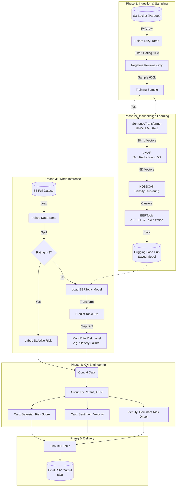

[[Deep learning on amazon reviews]]
# 🔄 End-to-End Project Lifecycle: Amazon Review Risk Analysis

This flow covers every technical step, library, and logic decision from raw data ingestion to the final dashboard-ready CSV.

---

## 📍 1. Text-Based Hierarchical Flowchart

### **Phase 1: Environment & Data Ingestion**
1.  **Environment Setup**
    *   Install optimized libraries (`polars`, `pyarrow`, `bertopic`, `hdbscan`, `umap-learn`, `sentence-transformers`).
    *   Configure S3 Connectivity (`s3fs`).
2.  **Lazy Loading (The Lakehouse Pattern)**
    *   Connect to S3 Bucket (`s3://.../health_household_reviews.parquet`).
    *   Initialize `pyarrow.dataset` for zero-copy access.
    *   Create **Polars LazyFrame** (`pl.scan_pyarrow_dataset`) for query optimization.

### **Phase 2: Training Data Preparation (Robust Mode)**
3.  **Predicate Pushdown Filtering**
    *   Apply filter `rating <= 3.0` at the I/O layer (load only negative reviews).
4.  **Stratified Sampling**
    *   Collect filtered data into memory.
    *   Sample **600,000 negative reviews** (Target-Rich Dataset) to address class imbalance.
    *   Isolate `final_text` list for training.

### **Phase 3: The Unsupervised Learning Pipeline (Training)**
5.  **Vectorization (Embedding)**
    *   Initialize `SentenceTransformer` (`all-MiniLM-L6-v2`).
    *   Encode text into **384-dimensional vectors**.
    *   Cast to `np.float16` for memory efficiency.
6.  **Dimensionality Reduction**
    *   Initialize **UMAP**.
    *   Compress vectors: 384 dims → **5 dims** (Cosine metric, 15 neighbors).
7.  **Clustering**
    *   Initialize **HDBSCAN**.
    *   Identify dense clusters (Min cluster size: 80).
    *   Isolate Noise/Outliers as **Topic -1**.
8.  **Topic Extraction & Modeling**
    *   Initialize **BERTopic**.
    *   Apply `CountVectorizer` (remove stop words, ngram_range 1-2).
    *   Calculate **c-TF-IDF** to extract specific keywords per cluster.
    *   **Fit** the model to the sampled data.
9.  **Model Serialization**
    *   Save trained model (`safetensors` format) locally.
    *   Push model to **Hugging Face Hub**.

### **Phase 4: Inference Strategy (Hybrid Approach)**
10. **Full Dataset Loading**
    *   Load specific S3 partition (Health & Household) via Polars.
    *   **Split Data:**
        *   **Subset A:** Negative Reviews (Rating <= 3).
        *   **Subset B:** Positive Reviews (Rating > 3).
11. **Negative Inference (Subset A)**
    *   Load pre-trained BERTopic model.
    *   Run `model.transform(docs)` to predict Topic IDs for negative reviews.
12. **Positive Handling (Subset B)**
    *   Bypass model.
    *   Auto-assign **Topic -2** (Custom ID for "Safe").
    *   Auto-assign Label **"Safe/No Risk"**.

### **Phase 5: Business Logic & Risk Tagging**
13. **Manual Risk Mapping**
    *   Inspect Top 30 Topics from training.
    *   Map Topic IDs to Human-Readable Labels (e.g., `Topic 3` → `"Premature Failure"`).
    *   Apply mapping to the inferred Negative Subset.
14. **Data Unification**
    *   Concatenate **Tagged Negatives** + **Auto-Safe Positives**.
    *   Save intermediate processed file to S3 (`processed/hh_reviews_with_risk.parquet`).

### **Phase 6: KPI Engineering & Aggregation**
15. **Product Universe Generation**
    *   Scan raw data to get unique `parent_asin` list (ensure no products are lost).
16. **Bayesian Risk Calculation**
    *   Group data by `parent_asin`.
    *   Calculate **Bayesian Risk Score**: `(Defects + 1) / (Total Reviews + 3)`.
    *   Calculate **Sentiment Velocity**: Correlation between `rating` and `timestamp`.
    *   Identify **Dominant Risk Driver** (Mode of risk category).
    *   Count total **Defects** and **Analyzed Reviews**.
17. **Final Join**
    *   Left Join `Product Universe` with `KPI Table`.
    *   Fill nulls (products with 0 reviews become "Low Risk").

### **Phase 7: Final Output**
18. **Export**
    *   Write final dataframe to **CSV** (`health_household_risk_kpis_only.csv`).
    *   Upload to S3 for consumption by Power BI / Dashboard.

---

## 🧜‍♂️ 2. Mermaid Diagram (Visual Flow)

